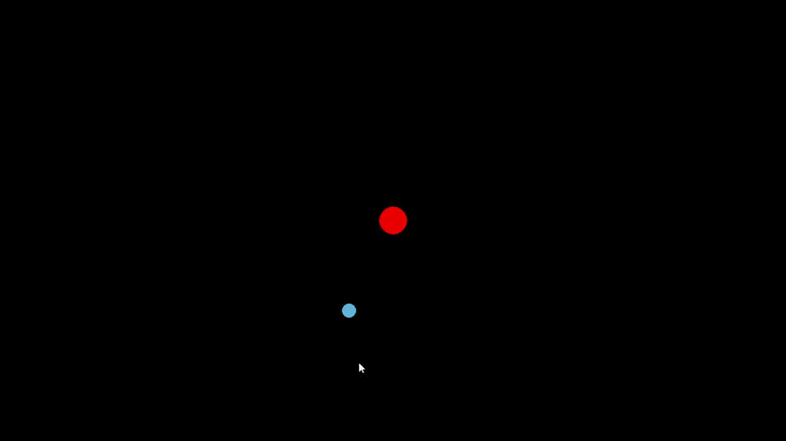

# 🪐 Planet Gravitation Simulation

For a fun project, I decided to create a Solar System gravity simulator, allowing the creation of planets orbiting around a central Sun.

## 🎥 Demo


## 🚀 Installation
1️⃣ Clone the repository:  
```sh
git clone https://github.com/blakeldridge/PlanetGravitationSimulation.git
cd PlanetGravitationSimulation
```
2️⃣ Install Dependencies:
```sh
pip install pygame
```
3️⃣ Run the Program:
```sh
python main.py
```

## 🔧 Technologies Used
- 🐍 Python
- 🎮 Pygame

## 📬 Contact
Created by **[Blake Eldridge](https://github.com/blakeldridge)** - Feel free to reach out! <br>
📧 **Email** : blakeldridge@gmail.com <br>
💼 **LinkedIn** : [blakeldridge](https://www.linkedin.com/in/blake-eldridge/)
